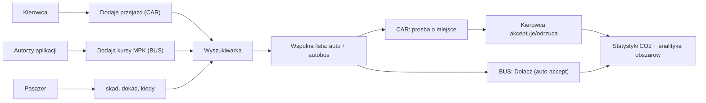

# Rozbudowa specyfikacji „Razem w Drogę"

Wszystkie zmiany dotyczą jednego pliku: [specifications/09-przejazd-wspoldzielony-mvp.md](specifications/09-przejazd-wspoldzielony-mvp.md). To rozbudowa dokumentu (markdown), bez zmian w kodzie aplikacji.

## Decyzje przyjęte (z odpowiedzi + inferencja)

- Nazwa **Razem w Drogę** zostaje, ale pozycjonowanie zmienia się na **lokalne-first**: pilotaż w subregionie nowosądeckim, krótkie trasy / dojazdy, uzupełnienie transportu publicznego — świadome odróżnienie od BlaBlaCar (długodystansowe, międzymiastowe).
- Połączenie autobusowe = ten sam model co przejazd autem (`Ride`) z polem `kind` (`CAR` / `BUS`). Autobusy dodajemy my (dane kuratorowane MPK Nowy Sącz, na start ograniczone do Nowego Sącza).
- Dołączenie do autobusu jest **natychmiast akceptowane** (status od razu `zaakceptowane`, bez wątku i decyzji kierowcy). Auta nadal przechodzą pełny flow prośby.
- Wyniki wyszukiwania: **jedna wspólna lista** posortowana wg trafności, z plakietką typu (auto / autobus MPK).
- Rejestrujemy dołączenia, by liczyć **zaoszczędzone CO2** i prostą **analitykę ruchu po obszarach** (strefy start/cel) — mocny argument dla partnera MPK i samorządu.

## Zmiana 1 - lokalne pozycjonowanie i kontekst wyzwania

- Przeredagować `## Decyzja nazwowa` i propozycję wartości: lead lokalny (pilotaż Nowy Sącz / subregion), uzupełnienie siatki MPK, nie konkurencja dla BlaBlaCar.
- Dodać sekcję `## Kontekst wyzwania (Dostępny transport dla każdego)`: osadzenie w wyzwaniu organizatora, partner **MPK Nowy Sącz** (5 mln wozokilometrów, ~9 gmin, nagroda za najbardziej przyjazną komunikację w Polsce, autobusy elektryczne / CNG), przeciwdziałanie wykluczeniu transportowemu, efekt uboczny dla czystego powietrza.
- W `## Ryzyka i odpowiedzi` dodać/zmienić wpis **„Czym różnimy się od BlaBlaCar?"** (lokalne, krótkie trasy, integracja z komunikacją publiczną) i zaktualizować „Czy produkt jest lokalny czy ogólnopolski?" na lokalny-first pilotaż.

## Zmiana 2 - multimodalność (auto + autobus)

- Rozszerzyć `## Cel MVP`: oprócz przejazdów aut, wyniki pokazują też połączenia autobusowe (MPK Nowy Sącz), dodawane przez autorów.
- W `### Model trasy przejazdu` dodać pole `kind` oraz pola transit (operator, numer linii, ew. cena biletu) widoczne tylko dla `BUS`.
- Dodać `## Flow 2b: dołączenie do połączenia autobusowego` - pasażer wybiera kurs i klika **Dołącz**, status od razu `zaakceptowane`, brak wątku.
- Zaktualizować `## Flow 2` (wyszukiwarka) i `### 3. Wyniki wyszukiwania`: wspólna lista z plakietką typu i powodami dopasowania (`dokładna trasa`, `blisko punktu startu`, `kurs MPK`).

## Zmiana 3 - model danych i statusy

- W `## Model danych domenowych` zaktualizować `Ride` o `kind` (`CAR`/`BUS`) i pola operatora/linii; zaznaczyć, że `BUS` jest seedowany przez autorów, bez właściciela-użytkownika.
- W `## Statusy prosby` dodać notkę: dla `BUS` prośba powstaje od razu jako `zaakceptowane` (auto-accept), bez wątku wiadomości.
- Dodać do modelu pola/encję dla statystyk: zapis dołączenia z dystansem trasy i strefą start/cel (na bazie `lat/lng`), wykorzystywany do CO2 i analityki obszarów. Najproścej: poszerzyć `RideRequest` (zaakceptowane = zliczany przejazd) zamiast nowej encji.

## Zmiana 4 - konto użytkownika i statystyki

- Dodać ekran `### 8. Konto / Profil użytkownika` w `## Ekrany MVP`: wybór okresu (np. ostatnie 30 dni / własny zakres) i kafelki:
  - zaoszczędzone CO2 (kg),
  - liczba przejazdów (łącznie + podział auto / autobus),
  - liczba jako pasażer / kierowca,
  - współdzielone kilometry,
  - (could have) mini-analityka: najczęstsze obszary start/cel.
- Dodać sekcję `## Szacowanie CO2 (MVP)`: prosty wskaźnik emisji (np. ~0,12 kg CO2/km dla auta solo), oszczędność = dystans współdzielony × wskaźnik; dla autobusu różnica między autem a emisją per-pasażer w komunikacji. Wyraźny disclaimer: szacunek demonstracyjny, nie pomiar produkcyjny.

## Zmiana 5 - zakres, dane demo, demo, pitch

- `## Zakres MVP`: dodać do **Must/Should** wyświetlanie autobusów w wynikach, dołączenie z auto-accept oraz ekran statystyk CO2; do **Could have** analitykę obszarów; usunąć z **Poza MVP** twierdzenie wykluczające autobusy (zostawić „pełny planer multimodalny" jako poza zakresem - my robimy uproszczoną wersję).
- `## Dane demonstracyjne`: dodać kilka kursów MPK Nowy Sącz z `lat/lng` przystanków oraz przykładowe dołączenia liczone do statystyk.
- `## Scenariusz demo` i `## Pitch`: dodać wątek lokalny + MPK, pokazanie autobusu w wynikach obok auta oraz ekranu „zaoszczędzone CO2"; w pitchu podkreślić wartość danych/analityki dla MPK i samorządu.

## Diagram docelowego flow (do wstawienia w spec)

