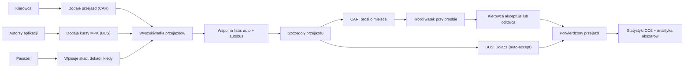

# 09 - Razem w Drogę: MVP lokalnych przejazdow wspoldzielonych

Specyfikacja MVP dla aplikacji **Razem w Drogę**: prostego, **lokalnego** narzedzia do znajdowania i organizowania codziennych przejazdow w subregionie nowosadeckim - laczacego przejazdy autem z polaczeniami komunikacji miejskiej.

> Powiazane: [01-hackathon-context.md](./01-hackathon-context.md), [08-jedzmy-sadeckie-spec.md](./08-jedzmy-sadeckie-spec.md), [05-tech-stack.md](./05-tech-stack.md), [06-hackathon-playbook.md](./06-hackathon-playbook.md)

## Decyzja nazwowa

Robocza nazwa produktu: **Razem w Drogę**.

Nie uzywamy w nazwie `Sadeckie`, `Malopolskie` ani innego regionu, bo sam mechanizm da sie pozniej uruchomic gdzie indziej. Ale **pozycjonowanie jest lokalne-first**: budujemy i demonstrujemy produkt jako narzedzie dla subregionu nowosadeckiego, w scislej relacji z lokalnym transportem publicznym (MPK Nowy Sącz). Skalowalnosc to historia na pozniej, nie obietnica MVP.

Jednozdaniowa propozycja wartosci:

> Razem w Drogę pomaga dojechac w okolicy: pokazuje wolne miejsce w aucie sasiada na trasie, ktora ktos i tak pokonuje, oraz pasujace kursy komunikacji miejskiej - w jednym miejscu, dla codziennych, lokalnych dojazdow.

### To nie jest BlaBlaCar

Swiadomie nie konkurujemy z platformami przejazdow miedzymiastowych typu BlaBlaCar:

- **Skala trasy**: BlaBlaCar to dlugie, miedzymiastowe przejazdy planowane z wyprzedzeniem. My celujemy w **krotkie, lokalne trasy** - dojazd do pracy, szkoly, lekarza, urzedu w obrebie gminy lub do Nowego Sącza.
- **Cel**: u nas chodzi o **przeciwdzialanie wykluczeniu transportowemu**, a nie o tanszy przejazd na wakacje.
- **Multimodalnosc**: pokazujemy auto **i** autobus obok siebie. Jezeli jest dobry kurs MPK, promujemy transport publiczny, a carpooling uzupelnia luki w siatce polaczen.
- **Lokalna spolecznosc**: pasazer i kierowca to czesto sasiedzi z tej samej okolicy, nie anonimowi ludzie z drugiego konca kraju.

## Kontekst wyzwania (Dostępny transport dla każdego)

Produkt powstaje pod wyzwanie **Dostępny transport dla każdego** z [Hackathonu dla Małopolski](./01-hackathon-context.md), ktorego celem jest przeciwdzialanie wykluczeniu transportowemu w subregionie nowosadeckim - szczegolnie dla seniorow i mlodziezy oraz mieszkancow gmin z rzadka siatka polaczen.

Partnerem wyzwania jest **MPK Nowy Sącz** - lokalny operator komunikacji miejskiej, ktory:

- wykonuje ok. **5 mln wozokilometrow rocznie** i obsluguje miasto Nowy Sącz oraz okoliczne gminy (ok. 9 gmin),
- zostal nagrodzony w niezaleznym badaniu jako **najbardziej przyjazna komunikacja w Polsce**,
- wymienia tabor na **autobusy elektryczne i CNG**, realizujac ustawe o elektromobilnosci.

Dlatego nasze rozwiazanie:

- **uzupelnia**, a nie zastepuje transport publiczny - tam gdzie jest dobry kurs MPK, kierujemy do niego, a carpooling lata luki (wieczory, weekendy, odlegle przysiolki),
- ma **efekt uboczny dla czystego powietrza** - mniej pustych aut na lokalnych trasach to mniejsza emisja (lacznik z wyzwaniem „Czyste powietrze dla regionu"),
- generuje **dane o realnych potrzebach przejazdowych** (skad-dokad-kiedy), ktore moga byc wartoscia dla operatora i samorzadu przy planowaniu siatki polaczen.

## Cel MVP

Pierwsza wersja nie jest pelnym planerem transportu. MVP ma udowodnic jeden konkretny scenariusz z realnym logowaniem Google, zapisem w bazie Supabase i geokodowanymi punktami przejazdu:

1. Kierowca oglasza przejazd autem.
2. My (autorzy aplikacji) dodajemy do bazy kursy komunikacji miejskiej (MPK Nowy Sącz).
3. Pasazer wyszukuje przejazd po dokladniejszym punkcie startu, celu i czasie.
4. System pokazuje najbardziej trafne opcje **w jednej wspolnej liscie** - i przejazdy autem, i kursy autobusowe, z plakietka typu.
5. Dla przejazdu autem pasazer prosi o miejsce i wskazuje, skad dokladnie chce zostac odebrany oraz dokad chce dojechac; kierowca moze dopytac w krotkim watku, po czym akceptuje albo odrzuca prosbe.
6. Dla kursu autobusowego pasazer klika **Dołącz** - dolaczenie jest od razu potwierdzone (bez watku i decyzji), a przejazd liczy sie do statystyk.

Najwazniejszy moment wartosci: uzytkownik nie przeglada przypadkowej tablicy ogloszen, tylko wpisuje realna potrzebe przejazdu: `skad`, `dokad`, `kiedy`, a aplikacja pokazuje pasujace opcje - zarowno auta sasiadow, jak i komunikacje miejska. Poniewaz `skad` i `dokad` sa wybierane z podpowiedzi geokodowania, system zna nie tylko nazwe miejscowosci, ale tez wspolrzedne punktow i moze lepiej ocenic bliskosc przejazdu.

### Dwa typy przejazdow

| Typ (`kind`) | Kto dodaje | Jak pasazer dolacza | Watek z kierowca |
| ------------ | ---------- | ------------------- | ---------------- |
| `CAR` (auto) | Zalogowany kierowca | Prosba o miejsce ze statusami `oczekuje` -> `zaakceptowane`/`odrzucone` | Tak, krotki watek |
| `BUS` (autobus MPK) | Autorzy aplikacji (dane kuratorowane) | Przycisk **Dołącz** - status od razu `zaakceptowane` | Nie |

Oba typy korzystaja z tego samego modelu wyszukiwania i z tego samego rejestru przejazdow do statystyk CO2 oraz analityki obszarow.

## Dla kogo

### Pasazerowie

Osoby, ktore chca dojechac do pracy, szkoly, lekarza, rodziny, urzedu, na wydarzenie albo do innej miejscowosci, ale nie maja wygodnego polaczenia lub nie chca jechac same autem.

### Kierowcy

Osoby, ktore i tak pokonuja dana trase i moga zabrac kogos po drodze. W MVP kierowca nie musi miec rozbudowanego profilu, ocen ani historii przejazdow.

## Glowne flow MVP



## Flow 1: kierowca dodaje przejazd

1. Kierowca wybiera akcje **Dodaj przejazd**.
2. Wpisuje podstawowe informacje:
   - skad jedzie - wybierane z autocomplete/geokodowania,
   - dokad jedzie - wybierane z autocomplete/geokodowania,
   - opcjonalne miejscowosci lub punkty po drodze,
   - data i godzina wyjazdu,
   - liczba wolnych miejsc,
   - orientacyjna cena lub informacja `bezplatnie`,
   - opcjonalny opis, np. punkt odbioru, bagaz, elastycznosc godziny.
3. System zapisuje przejazd jako dostepny razem z nazwami miejsc i wspolrzednymi `lat/lng`.
4. Przejazd pojawia sie w wynikach wyszukiwania pasazerow.

W MVP kierowca jest realnym zalogowanym uzytkownikiem Google. Profil moze byc uproszczony do imienia, e-maila/avatara z konta Google oraz danych przejazdu. Numer kontaktowy mozna pominac albo pokazac dopiero po akceptacji jako element demo.

### Model trasy przejazdu

Start i cel przejazdu sa obowiazkowymi polami `Ride`, a nie elementami listy waypointow. Maja specjalne znaczenie: buduja tytul przejazdu, sa wymagane w formularzu, sluza do podstawowego wyszukiwania i sa najwazniejsze w demo.

Waypointy oznaczaja wylacznie dodatkowe punkty po drodze:

```text
Ride
- kind            # CAR | BUS
- originLocation
- destinationLocation
- departureAt
- seats
- price
- description
# pola tylko dla kind = BUS:
- operator        # np. "MPK Nowy Sącz"
- lineNumber      # np. "12"
- ticketPrice     # orientacyjna cena biletu (zamiast price)

RideWaypoint[]
- location
- order
```

`kind` rozroznia przejazd autem (`CAR`) od kursu komunikacji miejskiej (`BUS`). Dla `CAR` wlascicielem jest zalogowany kierowca; dla `BUS` rekord jest seedowany przez autorow i nie ma wlasciciela-uzytkownika (pola operatora i numeru linii zastepuja imie kierowcy). Dla kursu autobusowego `RideWaypoint[]` moze odwzorowywac kolejne przystanki na trasie linii.

Pelna sekwencja trasy moze byc zlozona w aplikacji jako:

```text
[originLocation] + waypoints ordered + [destinationLocation]
```

To daje prosty model na MVP i nie zamyka drogi do pozniejszego trasowania po drogach.

## Flow 2: pasazer wyszukuje przejazd

1. Pasazer wpisuje:
   - `skad` - dokladniejszy punkt z autocomplete/geokodowania,
   - `dokad` - dokladniejszy punkt z autocomplete/geokodowania,
   - `kiedy`.
2. Opcjonalnie moze wskazac liczbe miejsc albo elastycznosc czasu, np. `+/- 1 godzina`.
3. System porownuje zapytanie z dostepnymi przejazdami - zarowno autami (`CAR`), jak i kursami autobusowymi (`BUS`).
4. Wyniki trafiaja do **jednej wspolnej listy** posortowanej od najbardziej trafnych, gdzie kazda karta ma plakietke typu (`auto` / `autobus MPK`).
5. Pasazer wybiera pozycje i przechodzi do szczegolow: dla auta - do prosby o miejsce, dla autobusu - do przycisku **Dołącz**.

### Kryteria trafnosci w MVP

W MVP trafnosc moze byc uproszczona i oparta na danych demonstracyjnych:

- zgodnosc miejscowosci startowej,
- zgodnosc miejscowosci docelowej,
- bliskosc punktu startu pasazera do startu przejazdu kierowcy,
- bliskosc punktu celu pasazera do celu przejazdu kierowcy,
- bliskosc godziny wyjazdu,
- liczba wolnych miejsc,
- ewentualne oznaczenie `po drodze`, jesli przejazd przechodzi przez miejscowosc lub punkt pasazera,
- typ przejazdu - kurs autobusowy moze byc oznaczony powodem `kurs MPK` i, jesli to dobre polaczenie, promowany jako ekologiczna opcja.

Geokodowanie miejsc jest w zakresie MVP, bo poprawia jakosc danych i pozwala pokazac lepsze dopasowanie niz sama nazwa miejscowosci. Nie budujemy jednak w MVP produkcyjnego routingu drogowego. Na start wystarczy porownywanie miejscowosci, punktow `lat/lng`, czasu oraz recznie dodanych punktow po drodze.

## Flow 2b: pasazer dolacza do kursu autobusowego

1. Pasazer otwiera szczegoly kursu autobusowego z wynikow wyszukiwania.
2. Widzi: trase i przystanki, operatora (np. `MPK Nowy Sącz`), numer linii, date i godzine odjazdu oraz orientacyjna cene biletu.
3. Pasazer klika **Dołącz**.
4. System tworzy rekord dolaczenia od razu ze statusem `zaakceptowane` - bez watku wiadomosci i bez decyzji kierowcy (kurs jest publiczny).
5. Przejazd pojawia sie w `Moje przejazdy` pasazera i jest liczony do statystyk (zaoszczedzone CO2, liczba przejazdow, analityka obszarow).

Dolaczenie do autobusu nie rezerwuje fizycznie miejsca - to lekkie oznaczenie zamiaru przejazdu, ktore sluzy spojnemu liczeniu statystyk i zbieraniu danych o realnych potrzebach przejazdowych na danym obszarze.

## Flow 3: pasazer prosi o miejsce

1. Pasazer otwiera szczegoly przejazdu.
2. Widzi najwazniejsze informacje:
   - trase,
   - date i godzine,
   - liczbe wolnych miejsc,
   - orientacyjny koszt,
   - imie kierowcy,
   - krotki opis przejazdu.
3. Pasazer klika **Popros o miejsce**.
4. Pasazer potwierdza albo zmienia:
   - punkt odbioru,
   - punkt docelowy,
   - liczbe miejsc,
   - pierwsza wiadomosc do kierowcy, np. `Moge dojsc do rynku` albo `Czy mozesz podjechac pod przychodnie?`.
5. System tworzy prosbe ze statusem `oczekuje`.
6. Pasazer widzi potwierdzenie wyslania prosby i watek wiadomości przy tej prosbie.

## Flow 4: kierowca decyduje

1. Kierowca widzi liste prosb o miejsce przy swoim przejezdzie.
2. Dla kazdej prosby widzi:
   - kto prosi o miejsce,
   - skad i dokad chce jechac pasazer,
   - odleglosc/powod dopasowania w uproszczonej formie,
   - wiadomosci w watku prosby.
3. Kierowca moze odpisac, np. dopytac o dokladny punkt odbioru albo zaproponowac inne miejsce spotkania.
4. Po ustaleniu szczegolow moze wybrac:
   - `zaakceptuj`,
   - `odrzuc`.
5. Po akceptacji status prosby zmienia sie na `zaakceptowane`.
6. Po odrzuceniu status prosby zmienia sie na `odrzucone`.
7. W MVP kontakt moze byc pokazany dopiero po akceptacji, jako element demo z fikcyjnymi danymi albo danymi z profilu Google.

## Statusy prosby

| Status          | Znaczenie                                                    |
| --------------- | ------------------------------------------------------------ |
| `oczekuje`      | Pasazer poprosil o miejsce, kierowca jeszcze nie zdecydowal. |
| `zaakceptowane` | Kierowca potwierdzil miejsce dla pasazera.                   |
| `odrzucone`     | Kierowca odrzucil prosbe albo nie ma juz miejsc.             |

Dla przejazdu autem (`CAR`) prosba zaczyna w statusie `oczekuje` i przechodzi w `zaakceptowane` albo `odrzucone` po decyzji kierowcy.

Dla kursu autobusowego (`BUS`) dolaczenie przez przycisk **Dołącz** powstaje **od razu w statusie `zaakceptowane`** (auto-accept) - nie ma stanu `oczekuje`, decyzji kierowcy ani watku wiadomosci, bo kurs jest publiczny. Status sluzy wtedy glownie spojnemu liczeniu statystyk.

Wiadomosci przy prosbie nie musza miec osobnych statusow. Sa przypiete do jednej prosby o miejsce (tylko dla `CAR`) i pozwalaja uzgodnic szczegoly przed decyzja kierowcy. To nie jest pelny chat w aplikacji, tylko kontekstowa rozmowa dotyczaca konkretnego przejazdu.

## Model danych domenowych

Docelowy model MVP:

| Model                | Rola                                                                                                                            |
| -------------------- | ------------------------------------------------------------------------------------------------------------------------------- |
| `User`               | Istniejacy model Auth.js; reprezentuje zalogowanego uzytkownika Google.                                                         |
| `Location`           | Wynik autocomplete/geokodowania: etykieta miejsca, miejscowosc, `lat`, `lng`, opcjonalny provider ID.                           |
| `Ride`               | Przejazd: `kind` (`CAR`/`BUS`), start, cel, data/godzina, miejsca, cena/opis, status. Dla `BUS` dochodza operator i numer linii. |
| `RideWaypoint`       | Opcjonalny punkt po drodze (dla `BUS` - kolejne przystanki), uporzadkowany polem `order`.                                       |
| `RideRequest`        | Dolaczenie pasazera do przejazdu: przejazd, pasazer, punkt odbioru, punkt docelowy, status, dystans i strefy do statystyk.       |
| `RideRequestMessage` | Krotka rozmowa przypieta do jednej prosby o miejsce (tylko dla `CAR`).                                                          |

Pole `Ride.kind` decyduje o sciezce: `CAR` (przejazd auta, wlasciciel = `User`-kierowca, pelny flow prosby) albo `BUS` (kurs MPK seedowany przez autorow, bez wlasciciela, dolaczenie z auto-accept). Dla obu typow zaakceptowany `RideRequest` jest **jednostka liczona do statystyk** (CO2, liczba przejazdow, analityka obszarow), dlatego zapisuje on tez `distanceKm` (orientacyjny dystans trasy pasazera) oraz strefy startu i celu (np. miejscowosc lub bucket `lat/lng`) do agregacji ruchu po obszarach.

Relacje w uproszczeniu:

```text
User 1---n Ride            # tylko dla kind = CAR; rekordy BUS nie maja wlasciciela
User 1---n RideRequest
Ride 1---n RideWaypoint
Ride 1---n RideRequest
User 1---n RideRequestMessage
RideRequest 1---n RideRequestMessage   # tylko dla kind = CAR
Location 1---n Ride as origin/destination
Location 1---n RideWaypoint
Location 1---n RideRequest as pickup/dropoff
```

## Ekrany MVP

### 1. Landing page

Krotko tlumaczy problem i kieruje do dwoch akcji:

- **Znajdz przejazd**,
- **Dodaj przejazd**.

### 2. Wyszukiwarka przejazdow

Najwazniejszy ekran pasazera. Formularz zawiera pola:

- skad - autocomplete/geokodowanie,
- dokad - autocomplete/geokodowanie,
- kiedy,
- opcjonalnie liczba miejsc.

### 3. Wyniki wyszukiwania

Jedna wspolna lista najbardziej trafnych opcji (auta i autobusy razem). Kazda karta pokazuje:

- plakietke typu: `auto` lub `autobus MPK`,
- trase,
- godzine wyjazdu,
- kierowce (dla auta) albo operatora i numer linii (dla autobusu),
- liczbe wolnych miejsc (dla auta),
- orientacyjny koszt / cene biletu,
- powod dopasowania, np. `dokladna trasa`, `blisko punktu startu`, `podobna godzina`, `punkt po drodze`, `kurs MPK`.

Akcja na karcie zalezy od typu: `Popros o miejsce` dla auta, `Dołącz` dla autobusu.

### 4. Szczegoly przejazdu

Ekran z pelniejszym opisem, lista punktow po drodze, podstawowym powodem dopasowania i przyciskiem **Popros o miejsce**.

### 5. Dodawanie przejazdu

Formularz kierowcy do ogloszenia trasy. Start i cel sa wybierane przez autocomplete/geokodowanie. Punkty po drodze sa opcjonalne i sluza do lepszego pokazania, kogo kierowca moze zabrac.

### 6. Moje przejazdy

Prosty widok pasazera z jego przejazdami: prosby o miejsce w autach (ze statusami i watkiem wiadomości) oraz dolaczenia do kursow autobusowych (od razu `zaakceptowane`). To zrodlo danych dla statystyk na koncie.

### 7. Panel kierowcy

Prosty widok kierowcy z dodanymi przejazdami autem, prosbami do akceptacji i mozliwoscia odpisania pasazerowi przed decyzja. Panel dotyczy tylko przejazdow `CAR` - kursy `BUS` nie maja wlasciciela-kierowcy.

### 8. Konto / Profil uzytkownika

Ekran ze statystykami zalogowanego uzytkownika. Na gorze wybor okresu (np. `ostatnie 30 dni`, `ten miesiac`, wlasny zakres dat), a pod nim kafelki:

- **Zaoszczedzone CO2** w wybranym okresie (kg) - glowny, wyrozniony wskaznik,
- **Liczba przejazdow** lacznie, z podzialem `auto` / `autobus`,
- **Przejazdy jako pasazer** vs **jako kierowca**,
- **Wspoldzielone kilometry** (suma `distanceKm` z zaakceptowanych przejazdow),
- (could have) **mini-analityka obszarow** - najczestsze strefy startu i celu, np. lista `Nowy Sącz <-> Stary Sącz: 4 przejazdy`.

Liczone sa wylacznie przejazdy w statusie `zaakceptowane` (dla auta - po akceptacji kierowcy, dla autobusu - od razu po dolaczeniu).

## Statystyki i szacowanie CO2

Statystyki licza sie z zaakceptowanych przejazdow (`RideRequest.status = zaakceptowane`), na podstawie zapisanego `distanceKm` oraz typu przejazdu.

### Metodologia (MVP)

Uzywamy prostego, jawnego wskaznika emisji - to **szacunek demonstracyjny**, nie pomiar produkcyjny:

- przyjmujemy emisyjnosc auta solo na poziomie ok. **0,12 kg CO2/km** (jeden kierowca, jeden samochod spalinowy),
- dla **przejazdu autem** (`CAR`) oszczednosc pasazera = `distanceKm x 0,12 kg` - bo zamiast jechac wlasnym autem, dolacza do kursu, ktory i tak sie odbywa,
- dla **kursu autobusowego** (`BUS`) oszczednosc = roznica miedzy autem solo a emisja per-pasazer w komunikacji miejskiej; dla uproszczenia w MVP mozemy przyjac wskaznik per-pasazer ok. **0,03 kg CO2/km**, czyli oszczednosc `distanceKm x (0,12 - 0,03) = distanceKm x 0,09 kg`,
- `distanceKm` liczymy orientacyjnie z odleglosci geograficznej miedzy punktem odbioru a celem (haversine na `lat/lng`), bez routingu drogowego.

Wartosci wskaznikow trzymamy jako stale w jednym miejscu w kodzie, zeby latwo je wytlumaczyc jury i ewentualnie podmienic. Na ekranie i w pitchu zaznaczamy, ze to oszacowanie.

### Analityka obszarow

Kazdy zaakceptowany przejazd zapisuje strefe startu i celu (miejscowosc lub bucket `lat/lng`). Pozwala to zagregowac **najczestsze relacje przejazdowe** (skad-dokad) w danym okresie. W MVP to prosta lista par stref z licznikiem, ale w pitchu prezentujemy ja jako wartosc dla **MPK i samorzadu**: realne dane o tym, gdzie ludzie chca jezdzic, przydatne przy planowaniu siatki polaczen.

## Dane demonstracyjne

Na hackathon wystarczy przygotowac kontrolowane dane, ktore dobrze pokazuja wyszukiwanie:

- kilka miejscowosci i konkretnych punktow z subregionu nowosadeckiego, zapisanych z `lat/lng`,
- 8-12 dostepnych przejazdow autem (`CAR`),
- **kilka kursow autobusowych MPK Nowy Sącz (`BUS`)** z numerem linii, przystankami (`lat/lng`) i godzinami - na start ograniczone do Nowego Sącza,
- kilka przejazdow z dokladnym dopasowaniem trasy,
- kilka przejazdow z dopasowaniem `po drodze`,
- kilka przejazdow, gdzie punkty sa w tej samej miejscowosci, ale w roznej odleglosci od siebie,
- kilka przejazdow w podobnej, ale nieidentycznej godzinie,
- przynajmniej jedno wyszukiwanie, w ktorym w wynikach pojawiaja sie obok siebie auto i kurs MPK,
- kilka fikcyjnych kierowcow,
- kilka fikcyjnych prosb pasazerow w roznych statusach oraz **kilka dolaczen do autobusow (od razu `zaakceptowane`)**,
- kilka przykladowych wiadomosci w watkach prosb,
- zaakceptowane przejazdy z roznych dni, tak by **ekran statystyk pokazal sensowne CO2 i liczby** dla wybranego okresu.

Punkty pochodza z subregionu nowosadeckiego (Nowy Sącz i okoliczne gminy) i sa spojne z lokalnym pozycjonowaniem produktu oraz z partnerem wyzwania (MPK Nowy Sącz).

## Zakres MVP

### Must have

- Landing page z nazwa **Razem w Drogę** i lokalnym pozycjonowaniem.
- Logowanie Google na bazie gotowego Auth.js.
- Formularz wyszukiwania przejazdow: `skad`, `dokad`, `kiedy`.
- Autocomplete/geokodowanie dla `skad` i `dokad`, z zapisem nazwy miejsca oraz `lat/lng`.
- Proste porownywanie odleglosci punktow na podstawie `lat/lng`.
- Wyniki wyszukiwania jako **wspolna lista aut i kursow autobusowych** z plakietka typu.
- Szczegoly przejazdu.
- Formularz dodania przejazdu autem przez kierowce.
- **Kursy autobusowe MPK (`BUS`) w danych i w wynikach** oraz przycisk **Dołącz** z auto-accept.
- Prosba pasazera o miejsce w aucie z punktem odbioru i punktem docelowym.
- Krotki watek wiadomosci przy prosbie o miejsce.
- Statusy prosby: `oczekuje`, `zaakceptowane`, `odrzucone` (dla `BUS` od razu `zaakceptowane`).
- Prosty panel kierowcy do akceptacji lub odrzucenia prosb.
- **Ekran konta ze statystykami: zaoszczedzone CO2 w wybranym okresie i liczba przejazdow.**
- Dane demonstracyjne pozwalajace przejsc caly scenariusz.

### Should have

- Oznaczenie powodu dopasowania przejazdu (w tym `kurs MPK`).
- Filtr elastycznosci czasu, np. `+/- 1 godzina`.
- Reczne dodawanie punktow po drodze przez kierowce.
- Mozliwosc wymiany wiecej niz jednej wiadomosci w watku prosby.
- Widok `Moje przejazdy` dla pasazera (auta i autobusy).
- Widok liczby pozostalych miejsc po akceptacji prosby.
- Podzial statystyk na `auto` / `autobus` oraz wybor zakresu dat na ekranie konta.

### Could have

- Prosta mapa demonstracyjna.
- Oznaczenie miejscowosci lub punktow `po drodze`.
- Prosty scoring trafnosci widoczny tylko w danych aplikacji.
- Udostepnienie linku do przejazdu.
- Mini-analityka obszarow (najczestsze relacje skad-dokad) jako wartosc dla MPK i samorzadu.

### Poza MVP

- Pelny planer multimodalny z kolej, rowerem, pieszo i rozkladami w czasie rzeczywistym (w MVP robimy tylko uproszczona multimodalnosc: auto + kuratorowane kursy autobusowe MPK).
- Integracja z prawdziwym API rozkladow MPK (w MVP dane autobusowe sa seedowane recznie).
- Tryb seniora z uproszczonym interfejsem.
- Panel samorzadowy i analiza luk transportowych.
- Zglaszanie braku polaczenia jako osobny produktowy flow.
- Rozbudowane profile i role uzytkownikow.
- Weryfikacja tozsamosci kierowcow i pasazerow.
- Platnosci i rozliczenia.
- Pelny chat w aplikacji niezalezny od konkretnej prosby o miejsce.
- Powiadomienia SMS, push lub e-mail.
- Produkcyjny routing drogowy i geolokalizacja.
- Oceny, reputacja i moderacja spolecznosci.
- Pelny regulamin carpoolingu.

Te elementy mozna opisac w pitchu jako naturalne kierunki rozwoju, ale nie jako zakres pierwszego demo.

## Ryzyka i odpowiedzi

### "Carpooling wymaga zaufania"

Odpowiedz: tak, dlatego MVP pokazuje tylko mechanizm dopasowania i prosby o miejsce. Produkcyjnie potrzebne bylyby weryfikacja, regulamin, zglaszanie naduzyc, moderacja i zasady odpowiedzialnosci.

### "Czy to nie jest tylko tablica ogloszen?"

Odpowiedz: nie, bo kluczowa wartoscia jest wyszukiwanie po konkretnej potrzebie pasazera. Uzytkownik podaje trase i czas, a system pokazuje najbardziej trafne przejazdy zamiast zmuszac go do recznego przegladania ogloszen.

### "Czym rozni sie to od BlaBlaCar?"

Odpowiedz: BlaBlaCar to dlugie, miedzymiastowe przejazdy planowane z wyprzedzeniem. My robimy **lokalne, krotkie dojazdy** w obrebie subregionu nowosadeckiego, nastawione na przeciwdzialanie wykluczeniu transportowemu. Najwazniejsza roznica: laczymy carpooling z **komunikacja publiczna** (kursy MPK Nowy Sącz w tych samych wynikach), wiec uzupelniamy siatke polaczen, zamiast konkurowac z duza platforma na jej polu.

### "Czy produkt jest lokalny czy ogolnopolski?"

Odpowiedz: pozycjonowanie jest **lokalne-first** - budujemy i pokazujemy pilotaż dla subregionu nowosadeckiego we wspolpracy z MPK Nowy Sącz. Sam mechanizm jest przenoszalny, wiec w przyszlosci mozna go uruchomic w innym regionie, ale to historia rozwoju, a nie obietnica MVP.

### "Co z bezpieczenstwem danych?"

Odpowiedz: w MVP uzywamy danych demonstracyjnych. Wersja produkcyjna musialaby uwzglednic minimalizacje danych osobowych, zgody, regulamin, polityke prywatnosci i bezpieczne udostepnianie kontaktu dopiero po akceptacji.

## Scenariusz demo

Najlepszy wariant prezentacji: pokazac dwie perspektywy rownoczesnie, bez przelogowywania w trakcie demo.

Setup przed prezentacja:

- lewa strona ekranu: przegladarka kierowcy, zalogowana na konto Google kierowcy,
- prawa strona ekranu: druga przegladarka albo okno incognito, zalogowane na konto Google pasazera,
- oba konta maja przygotowane dane demo i sa otwarte na odpowiednich ekranach aplikacji.

Przebieg:

1. Pokazujemy landing page **Razem w Drogę** i krotko tlumaczymy problem - lokalne dojazdy w subregionie nowosadeckim, uzupelnienie MPK.
2. W oknie kierowcy dodajemy przejazd autem: start i cel z autocomplete, opcjonalnie punkty po drodze.
3. W oknie pasazera wybieramy **Znajdz przejazd**.
4. Pasazer wpisuje przykladowy punkt startu, punkt docelowy, date i godzine.
5. System pokazuje wspolna liste: przejazd auta z powodem `blisko punktu startu` **oraz kurs autobusowy MPK** z plakietka `autobus MPK` - podkreslamy multimodalnosc.
6. Pasazer wybiera przejazd autem i klika **Popros o miejsce**, potwierdza punkt odbioru, punkt docelowy i wysyla pierwsza wiadomosc.
7. W oknie kierowcy pojawia sie prosba o miejsce; kierowca odpisuje w watku albo od razu akceptuje.
8. W oknie pasazera widac zmiane statusu na `zaakceptowane`.
9. (Opcjonalnie) pokazujemy alternatywe: pasazer wybiera kurs MPK i klika **Dołącz** - dolaczenie jest od razu potwierdzone.
10. Na koniec wchodzimy na **ekran konta pasazera** i pokazujemy statystyki: zaoszczedzone CO2 w wybranym okresie oraz liczbe przejazdow z podzialem auto / autobus.

Ten wariant dobrze pokazuje, ze aplikacja ma prawdziwy przeplyw miedzy uzytkownikami, laczy carpooling z komunikacja miejska i mierzy realny efekt (CO2), a nie tylko statyczne ekrany.

## Pitch 30 sekund

**Razem w Drogę** to lokalna aplikacja do codziennych dojazdow w subregionie nowosadeckim. Pasazer wpisuje, skad, dokad i kiedy chce jechac, a my w jednej liscie pokazujemy i wolne miejsca w autach sasiadow, i pasujace kursy MPK Nowy Sącz. Punkty sa wybierane z podpowiedzi, wiec system zna ich wspolrzedne i daje trafniejsze dopasowania. Pasazer prosi o miejsce w aucie albo jednym kliknieciem dolacza do autobusu, a aplikacja pokazuje, ile dzieki temu zaoszczedzil CO2. To nie kolejny BlaBlaCar - to narzedzie przeciw wykluczeniu transportowemu, uzupelniajace komunikacje publiczna.

## Pitch 3 minuty - struktura

1. **Problem** - w subregionie nowosadeckim wiele osob jest zagrozonych wykluczeniem transportowym; sa luki w siatce polaczen, a wokol jezdza auta z wolnymi miejscami.
2. **Rozwiazanie** - **Razem w Drogę** laczy lokalny carpooling z komunikacja miejska (MPK Nowy Sącz) w jednym wyszukiwaniu po trasie i czasie.
3. **Demo pasazera** - wpisanie `skad`, `dokad`, `kiedy` i wspolna lista: auto sasiada **i** kurs MPK obok siebie.
4. **Lepsze dopasowanie** - aplikacja zapisuje wspolrzedne punktow, rozumie punkty po drodze i promuje dobry kurs autobusowy.
5. **Demo kierowcy** - dodanie przejazdu, odpowiedz w watku prosby i akceptacja miejsca; alternatywnie dolaczenie do autobusu jednym kliknieciem.
6. **Efekt i dane** - ekran konta z zaoszczedzonym CO2 oraz analityka relacji skad-dokad jako wartosc dla MPK i samorzadu przy planowaniu polaczen.
7. **Zakres MVP** - jeden dopracowany, lokalny flow zamiast wielu niedokonczonych funkcji.
8. **Rozwoj** - pozniej routing drogowy, mapy, integracja z API rozkladow MPK, pelny planer multimodalny, tryb seniora, panel samorzadowy, weryfikacje i platnosci.

## Definicja gotowosci demo

Projekt jest gotowy do prezentacji, jezeli:

- da sie dodac przejazd autem jako kierowca,
- w danych sa kursy autobusowe MPK i pojawiaja sie w wynikach,
- da sie wyszukac przejazd jako pasazer,
- wyniki to wspolna lista aut i autobusow z czytelna plakietka typu,
- punkty startu i celu sa zapisywane z nazwa oraz wspolrzednymi,
- wyniki sa posortowane tak, ze najbardziej trafny przejazd jest widoczny na gorze,
- da sie wyslac prosbe o miejsce w aucie (z punktem odbioru, celem i pierwsza wiadomoscia),
- da sie dolaczyc do kursu autobusowego, a status jest od razu `zaakceptowane`,
- kierowca moze odpowiedziec w watku prosby oraz zaakceptowac albo odrzucic prosbe,
- status prosby zmienia sie czytelnie dla pasazera,
- ekran konta pokazuje zaoszczedzone CO2 i liczbe przejazdow dla wybranego okresu,
- caly scenariusz miesci sie w 3-minutowym demo.
