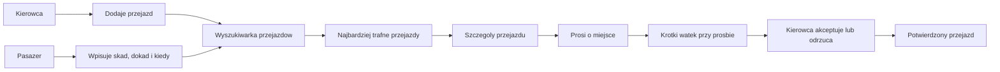

# 09 - Razem w Drogę: MVP przejazdow wspoldzielonych

Specyfikacja MVP dla aplikacji **Razem w Drogę**: prostego narzedzia do znajdowania i organizowania przejazdow wspoldzielonych w Polsce.

> Powiazane: [08-jedzmy-sadeckie-spec.md](./08-jedzmy-sadeckie-spec.md), [05-tech-stack.md](./05-tech-stack.md), [06-hackathon-playbook.md](./06-hackathon-playbook.md)

## Decyzja nazwowa

Robocza nazwa produktu: **Razem w Drogę**.

Nie uzywamy w nazwie `Sadeckie`, `Malopolskie` ani innego regionu, bo produkt ma byc mozliwy do uruchomienia w dowolnym miejscu w Polsce. Region moze byc uzyty jako kontekst pilotażu, zestaw danych demonstracyjnych albo historia w pitchu, ale nie jako ograniczenie marki.

Jednozdaniowa propozycja wartosci:

> Razem w Drogę pomaga znalezc wolne miejsce w aucie na trasie, ktora ktos i tak pokonuje, albo oglosic przejazd, do ktorego inni moga dolaczyc.

## Cel MVP

Pierwsza wersja nie jest pelnym planerem transportu. MVP ma udowodnic jeden konkretny scenariusz z realnym logowaniem Google, zapisem w bazie Supabase i geokodowanymi punktami przejazdu:

1. Kierowca oglasza przejazd.
2. Pasazer wyszukuje przejazd po dokladniejszym punkcie startu, celu i czasie.
3. System pokazuje najbardziej trafne przejazdy.
4. Pasazer prosi o miejsce i wskazuje, skad dokladnie chce zostac odebrany oraz dokad chce dojechac.
5. Kierowca moze dopytac w krotkim watku przy prosbie.
6. Kierowca akceptuje albo odrzuca prosbe.

Najwazniejszy moment wartosci: uzytkownik nie przeglada przypadkowej tablicy ogloszen, tylko wpisuje realna potrzebe przejazdu: `skad`, `dokad`, `kiedy`, a aplikacja pokazuje pasujace opcje. Poniewaz `skad` i `dokad` sa wybierane z podpowiedzi geokodowania, system zna nie tylko nazwe miejscowosci, ale tez wspolrzedne punktow i moze lepiej ocenic bliskosc przejazdu.

## Dla kogo

### Pasazerowie

Osoby, ktore chca dojechac do pracy, szkoly, lekarza, rodziny, urzedu, na wydarzenie albo do innej miejscowosci, ale nie maja wygodnego polaczenia lub nie chca jechac same autem.

### Kierowcy

Osoby, ktore i tak pokonuja dana trase i moga zabrac kogos po drodze. W MVP kierowca nie musi miec rozbudowanego profilu, ocen ani historii przejazdow.

## Glowne flow MVP



## Flow 1: kierowca dodaje przejazd

1. Kierowca wybiera akcje **Dodaj przejazd**.
2. Wpisuje podstawowe informacje:
   - skad jedzie - wybierane z autocomplete/geokodowania,
   - dokad jedzie - wybierane z autocomplete/geokodowania,
   - opcjonalne miejscowosci lub punkty po drodze,
   - data i godzina wyjazdu,
   - liczba wolnych miejsc,
   - orientacyjna cena lub informacja `bezplatnie`,
   - opcjonalny opis, np. punkt odbioru, bagaz, elastycznosc godziny.
3. System zapisuje przejazd jako dostepny razem z nazwami miejsc i wspolrzednymi `lat/lng`.
4. Przejazd pojawia sie w wynikach wyszukiwania pasazerow.

W MVP kierowca jest realnym zalogowanym uzytkownikiem Google. Profil moze byc uproszczony do imienia, e-maila/avatara z konta Google oraz danych przejazdu. Numer kontaktowy mozna pominac albo pokazac dopiero po akceptacji jako element demo.

### Model trasy przejazdu

Start i cel przejazdu sa obowiazkowymi polami `Ride`, a nie elementami listy waypointow. Maja specjalne znaczenie: buduja tytul przejazdu, sa wymagane w formularzu, sluza do podstawowego wyszukiwania i sa najwazniejsze w demo.

Waypointy oznaczaja wylacznie dodatkowe punkty po drodze:

```text
Ride
- originLocation
- destinationLocation
- departureAt
- seats
- price
- description

RideWaypoint[]
- location
- order
```

Pelna sekwencja trasy moze byc zlozona w aplikacji jako:

```text
[originLocation] + waypoints ordered + [destinationLocation]
```

To daje prosty model na MVP i nie zamyka drogi do pozniejszego trasowania po drogach.

## Flow 2: pasazer wyszukuje przejazd

1. Pasazer wpisuje:
   - `skad` - dokladniejszy punkt z autocomplete/geokodowania,
   - `dokad` - dokladniejszy punkt z autocomplete/geokodowania,
   - `kiedy`.
2. Opcjonalnie moze wskazac liczbe miejsc albo elastycznosc czasu, np. `+/- 1 godzina`.
3. System porownuje zapytanie z dostepnymi przejazdami.
4. Wyniki sa sortowane od najbardziej trafnych.
5. Pasazer wybiera przejazd i przechodzi do szczegolow.

### Kryteria trafnosci w MVP

W MVP trafnosc moze byc uproszczona i oparta na danych demonstracyjnych:

- zgodnosc miejscowosci startowej,
- zgodnosc miejscowosci docelowej,
- bliskosc punktu startu pasazera do startu przejazdu kierowcy,
- bliskosc punktu celu pasazera do celu przejazdu kierowcy,
- bliskosc godziny wyjazdu,
- liczba wolnych miejsc,
- ewentualne oznaczenie `po drodze`, jesli przejazd przechodzi przez miejscowosc lub punkt pasazera.

Geokodowanie miejsc jest w zakresie MVP, bo poprawia jakosc danych i pozwala pokazac lepsze dopasowanie niz sama nazwa miejscowosci. Nie budujemy jednak w MVP produkcyjnego routingu drogowego. Na start wystarczy porownywanie miejscowosci, punktow `lat/lng`, czasu oraz recznie dodanych punktow po drodze.

## Flow 3: pasazer prosi o miejsce

1. Pasazer otwiera szczegoly przejazdu.
2. Widzi najwazniejsze informacje:
   - trase,
   - date i godzine,
   - liczbe wolnych miejsc,
   - orientacyjny koszt,
   - imie kierowcy,
   - krotki opis przejazdu.
3. Pasazer klika **Popros o miejsce**.
4. Pasazer potwierdza albo zmienia:
   - punkt odbioru,
   - punkt docelowy,
   - liczbe miejsc,
   - pierwsza wiadomosc do kierowcy, np. `Moge dojsc do rynku` albo `Czy mozesz podjechac pod przychodnie?`.
5. System tworzy prosbe ze statusem `oczekuje`.
6. Pasazer widzi potwierdzenie wyslania prosby i watek wiadomości przy tej prosbie.

## Flow 4: kierowca decyduje

1. Kierowca widzi liste prosb o miejsce przy swoim przejezdzie.
2. Dla kazdej prosby widzi:
   - kto prosi o miejsce,
   - skad i dokad chce jechac pasazer,
   - odleglosc/powod dopasowania w uproszczonej formie,
   - wiadomosci w watku prosby.
3. Kierowca moze odpisac, np. dopytac o dokladny punkt odbioru albo zaproponowac inne miejsce spotkania.
4. Po ustaleniu szczegolow moze wybrac:
   - `zaakceptuj`,
   - `odrzuc`.
5. Po akceptacji status prosby zmienia sie na `zaakceptowane`.
6. Po odrzuceniu status prosby zmienia sie na `odrzucone`.
7. W MVP kontakt moze byc pokazany dopiero po akceptacji, jako element demo z fikcyjnymi danymi albo danymi z profilu Google.

## Statusy prosby

| Status          | Znaczenie                                                    |
| --------------- | ------------------------------------------------------------ |
| `oczekuje`      | Pasazer poprosil o miejsce, kierowca jeszcze nie zdecydowal. |
| `zaakceptowane` | Kierowca potwierdzil miejsce dla pasazera.                   |
| `odrzucone`     | Kierowca odrzucil prosbe albo nie ma juz miejsc.             |

Wiadomosci przy prosbie nie musza miec osobnych statusow. Sa przypiete do jednej prosby o miejsce i pozwalaja uzgodnic szczegoly przed decyzja kierowcy. To nie jest pelny chat w aplikacji, tylko kontekstowa rozmowa dotyczaca konkretnego przejazdu.

## Model danych domenowych

Docelowy model MVP:

| Model                | Rola                                                                                                  |
| -------------------- | ----------------------------------------------------------------------------------------------------- |
| `User`               | Istniejacy model Auth.js; reprezentuje zalogowanego uzytkownika Google.                               |
| `Location`           | Wynik autocomplete/geokodowania: etykieta miejsca, miejscowosc, `lat`, `lng`, opcjonalny provider ID. |
| `Ride`               | Przejazd kierowcy: start, cel, data/godzina, miejsca, cena/opis, status.                              |
| `RideWaypoint`       | Opcjonalny punkt po drodze dla przejazdu, uporzadkowany polem `order`.                                |
| `RideRequest`        | Prosba pasazera o miejsce: przejazd, pasazer, punkt odbioru, punkt docelowy, status.                  |
| `RideRequestMessage` | Krotka rozmowa przypieta do jednej prosby o miejsce.                                                  |

Relacje w uproszczeniu:

```text
User 1---n Ride
User 1---n RideRequest
Ride 1---n RideWaypoint
Ride 1---n RideRequest
User 1---n RideRequestMessage
RideRequest 1---n RideRequestMessage
Location 1---n Ride as origin/destination
Location 1---n RideWaypoint
Location 1---n RideRequest as pickup/dropoff
```

## Ekrany MVP

### 1. Landing page

Krotko tlumaczy problem i kieruje do dwoch akcji:

- **Znajdz przejazd**,
- **Dodaj przejazd**.

### 2. Wyszukiwarka przejazdow

Najwazniejszy ekran pasazera. Formularz zawiera pola:

- skad - autocomplete/geokodowanie,
- dokad - autocomplete/geokodowanie,
- kiedy,
- opcjonalnie liczba miejsc.

### 3. Wyniki wyszukiwania

Lista najbardziej trafnych przejazdow. Kazda karta pokazuje:

- trase,
- godzine wyjazdu,
- kierowce,
- liczbe wolnych miejsc,
- orientacyjny koszt,
- powod dopasowania, np. `dokladna trasa`, `blisko punktu startu`, `podobna godzina`, `punkt po drodze`.

### 4. Szczegoly przejazdu

Ekran z pelniejszym opisem, lista punktow po drodze, podstawowym powodem dopasowania i przyciskiem **Popros o miejsce**.

### 5. Dodawanie przejazdu

Formularz kierowcy do ogloszenia trasy. Start i cel sa wybierane przez autocomplete/geokodowanie. Punkty po drodze sa opcjonalne i sluza do lepszego pokazania, kogo kierowca moze zabrac.

### 6. Moje prosby

Prosty widok pasazera z prosbami, ich statusami i watkiem wiadomości dla kazdej prosby.

### 7. Panel kierowcy

Prosty widok kierowcy z dodanymi przejazdami, prosbami do akceptacji i mozliwoscia odpisania pasazerowi przed decyzja.

## Dane demonstracyjne

Na hackathon wystarczy przygotowac kontrolowane dane, ktore dobrze pokazuja wyszukiwanie:

- kilka miejscowosci i konkretnych punktow z jednego regionu pilotażowego, zapisanych z `lat/lng`,
- 8-12 dostepnych przejazdow,
- kilka przejazdow z dokladnym dopasowaniem trasy,
- kilka przejazdow z dopasowaniem `po drodze`,
- kilka przejazdow, gdzie punkty sa w tej samej miejscowosci, ale w roznej odleglosci od siebie,
- kilka przejazdow w podobnej, ale nieidentycznej godzinie,
- kilka fikcyjnych kierowcow,
- kilka fikcyjnych prosb pasazerow w roznych statusach,
- kilka przykladowych wiadomosci w watkach prosb.

Przykladowe miejscowosci moga pochodzic z Malopolski lub subregionu nowosadeckiego, ale nalezy je przedstawic jako dane demonstracyjne, nie jako ograniczenie produktu.

## Zakres MVP

### Must have

- Landing page z nazwa **Razem w Drogę**.
- Logowanie Google na bazie gotowego Auth.js.
- Formularz wyszukiwania przejazdow: `skad`, `dokad`, `kiedy`.
- Autocomplete/geokodowanie dla `skad` i `dokad`, z zapisem nazwy miejsca oraz `lat/lng`.
- Proste porownywanie odleglosci punktow na podstawie `lat/lng`.
- Wyniki wyszukiwania z najbardziej trafnymi przejazdami.
- Szczegoly przejazdu.
- Formularz dodania przejazdu przez kierowce.
- Prosba pasazera o miejsce z punktem odbioru i punktem docelowym.
- Krotki watek wiadomosci przy prosbie o miejsce.
- Statusy prosby: `oczekuje`, `zaakceptowane`, `odrzucone`.
- Prosty panel kierowcy do akceptacji lub odrzucenia prosb.
- Dane demonstracyjne pozwalajace przejsc caly scenariusz.

### Should have

- Oznaczenie powodu dopasowania przejazdu.
- Filtr elastycznosci czasu, np. `+/- 1 godzina`.
- Reczne dodawanie punktow po drodze przez kierowce.
- Mozliwosc wymiany wiecej niz jednej wiadomosci w watku prosby.
- Widok `Moje prosby` dla pasazera.
- Widok liczby pozostalych miejsc po akceptacji prosby.

### Could have

- Prosta mapa demonstracyjna.
- Oznaczenie miejscowosci lub punktow `po drodze`.
- Prosty scoring trafnosci widoczny tylko w danych aplikacji.
- Udostepnienie linku do przejazdu.

### Poza MVP

- Pelny planer multimodalny laczacy autobus, kolej, rower, pieszo i carpooling.
- Tryb seniora z uproszczonym interfejsem.
- Panel samorzadowy i analiza luk transportowych.
- Zglaszanie braku polaczenia jako osobny produktowy flow.
- Rozbudowane profile i role uzytkownikow.
- Weryfikacja tozsamosci kierowcow i pasazerow.
- Platnosci i rozliczenia.
- Pelny chat w aplikacji niezalezny od konkretnej prosby o miejsce.
- Powiadomienia SMS, push lub e-mail.
- Produkcyjny routing drogowy i geolokalizacja.
- Oceny, reputacja i moderacja spolecznosci.
- Pelny regulamin carpoolingu.

Te elementy mozna opisac w pitchu jako naturalne kierunki rozwoju, ale nie jako zakres pierwszego demo.

## Ryzyka i odpowiedzi

### "Carpooling wymaga zaufania"

Odpowiedz: tak, dlatego MVP pokazuje tylko mechanizm dopasowania i prosby o miejsce. Produkcyjnie potrzebne bylyby weryfikacja, regulamin, zglaszanie naduzyc, moderacja i zasady odpowiedzialnosci.

### "Czy to nie jest tylko tablica ogloszen?"

Odpowiedz: nie, bo kluczowa wartoscia jest wyszukiwanie po konkretnej potrzebie pasazera. Uzytkownik podaje trase i czas, a system pokazuje najbardziej trafne przejazdy zamiast zmuszac go do recznego przegladania ogloszen.

### "Czy produkt jest lokalny czy ogolnopolski?"

Odpowiedz: marka jest ogolnopolska, a dane demonstracyjne moga byc lokalne. To pozwala pokazac realistyczny pilotaż bez zamykania produktu w jednym regionie.

### "Co z bezpieczenstwem danych?"

Odpowiedz: w MVP uzywamy danych demonstracyjnych. Wersja produkcyjna musialaby uwzglednic minimalizacje danych osobowych, zgody, regulamin, polityke prywatnosci i bezpieczne udostepnianie kontaktu dopiero po akceptacji.

## Scenariusz demo

Najlepszy wariant prezentacji: pokazac dwie perspektywy rownoczesnie, bez przelogowywania w trakcie demo.

Setup przed prezentacja:

- lewa strona ekranu: przegladarka kierowcy, zalogowana na konto Google kierowcy,
- prawa strona ekranu: druga przegladarka albo okno incognito, zalogowane na konto Google pasazera,
- oba konta maja przygotowane dane demo i sa otwarte na odpowiednich ekranach aplikacji.

Przebieg:

1. Pokazujemy landing page **Razem w Drogę** i krotko tlumaczymy problem.
2. W oknie kierowcy dodajemy przejazd: start i cel z autocomplete, opcjonalnie punkty po drodze.
3. W oknie pasazera wybieramy **Znajdz przejazd**.
4. Pasazer wpisuje przykladowy punkt startu, punkt docelowy, date i godzine.
5. System pokazuje 2-3 najlepiej dopasowane przejazdy z powodem dopasowania, np. `blisko punktu startu` albo `punkt po drodze`.
6. Pasazer wybiera przejazd i klika **Popros o miejsce**.
7. Pasazer potwierdza punkt odbioru, punkt docelowy i wysyla pierwsza wiadomosc.
8. W oknie kierowcy pojawia sie prosba o miejsce.
9. Kierowca odpisuje w watku albo od razu akceptuje prosbe.
10. W oknie pasazera widac zmiane statusu na `zaakceptowane`.

Ten wariant dobrze pokazuje, ze aplikacja ma prawdziwy przeplyw miedzy uzytkownikami, a nie tylko statyczne ekrany.

## Pitch 30 sekund

**Razem w Drogę** to aplikacja do przejazdow wspoldzielonych. Kierowca oglasza trase, ktora i tak pokonuje, a pasazer wpisuje, skad, dokad i kiedy chce jechac. Miejsca sa wybierane z podpowiedzi, wiec system zna ich wspolrzedne i moze pokazac trafniejsze dopasowania niz zwykla zgodnosc miejscowosci. Pasazer prosi o miejsce, kierowca moze dopytac o szczegoly i zaakceptowac przejazd. To prosty sposob, zeby wolne miejsca w autach zaczely realnie pomagac ludziom w codziennych dojazdach.

## Pitch 3 minuty - struktura

1. **Problem** - wiele osob potrzebuje dojazdu, a wokol nich sa auta jadace w podobnym kierunku z wolnymi miejscami.
2. **Rozwiazanie** - **Razem w Drogę** laczy te dwie strony przez wyszukiwanie przejazdow po trasie i czasie.
3. **Demo pasazera** - wpisanie `skad`, `dokad`, `kiedy` i wybor najlepszego przejazdu.
4. **Lepsze dopasowanie** - pokazanie, ze aplikacja zapisuje wspolrzedne punktow i rozumie punkty po drodze.
5. **Demo kierowcy** - dodanie przejazdu, odpowiedz w watku prosby i akceptacja miejsca.
6. **Zakres MVP** - jeden dopracowany flow zamiast wielu niedokonczonych funkcji.
7. **Rozwoj** - pozniej mozna dodac routing drogowy, mapy, planer multimodalny, tryb seniora, panel samorzadowy, weryfikacje i platnosci.

## Definicja gotowosci demo

Projekt jest gotowy do prezentacji, jezeli:

- da sie dodac przejazd jako kierowca,
- da sie wyszukac przejazd jako pasazer,
- punkty startu i celu sa zapisywane z nazwa oraz wspolrzednymi,
- wyniki sa posortowane tak, ze najbardziej trafny przejazd jest widoczny na gorze,
- da sie wyslac prosbe o miejsce,
- prosba zawiera punkt odbioru, punkt docelowy i pierwsza wiadomosc,
- kierowca moze odpowiedziec w watku prosby,
- da sie zaakceptowac albo odrzucic prosbe jako kierowca,
- status prosby zmienia sie czytelnie dla pasazera,
- caly scenariusz miesci sie w 3-minutowym demo.
